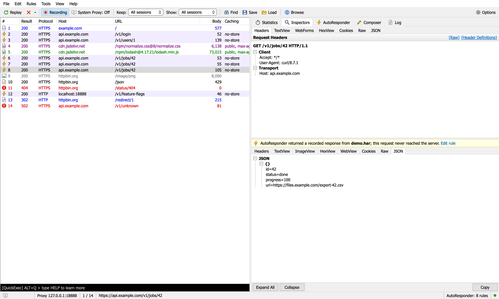
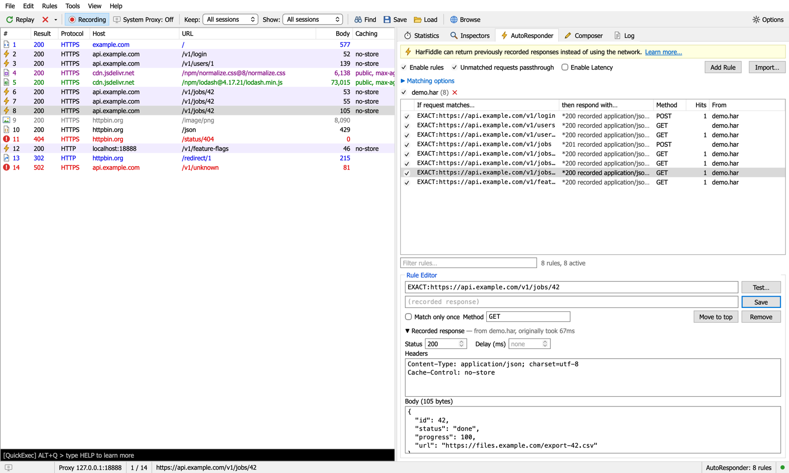

<p align="center">
  
</p>

<h1 align="center">HarFiddle</h1>

<p align="center">
  An HTTP/HTTPS debugging proxy for macOS that can replay HAR files.<br>
  <a href="../../releases/latest">Download</a> · <a href="#usage">Usage</a> · <a href="#autoresponder-reference">AutoResponder</a> · <a href="#https">HTTPS</a> · <a href="#build-from-source">Build</a>
</p>

<p align="center"><sub>Sponsored by <a href="https://catmouse.ai/">Catmouse</a></sub></p>



HarFiddle sits between your apps and the network. It records every request and response, lets you inspect and
change them, and can answer requests itself from a HAR file instead of the real server.

Use it to:

- **Replay a HAR file as a mock server.** Load a HAR and point your app at `http://localhost:8888`. Each request gets
  the response that was recorded for it, in the order it was recorded. Handy for reproducing a bug from a customer's
  HAR, working offline, or testing against a flaky API.
- **Capture and inspect HTTP and HTTPS traffic** from your whole Mac, one browser, or any command-line tool.
- **Open HAR files** exported from Chrome, Firefox, Safari, Charles, Proxyman and others, and browse them like live
  traffic.
- **Change responses on the fly**: answer with a recorded or edited response, a local file, a different status code,
  a delay, or forward the request to another server.

It runs natively on Apple Silicon and Intel Macs (macOS 12 or later). Node.js is bundled in the app, so there is
nothing else to install. If you have used Fiddler Classic on Windows, the layout and shortcuts will feel familiar.

## Download

1. Get `HarFiddle-<version>-macOS-universal.dmg` from [Releases](../../releases/latest).
2. Open it and drag HarFiddle to Applications.
3. The app is open source and not notarized by Apple, so macOS blocks the first launch. Either:
   - open **System Settings › Privacy & Security**, scroll down and click **Open Anyway**, or
   - run `xattr -dr com.apple.quarantine /Applications/HarFiddle.app` in Terminal.

## Usage

### Replay a HAR file

Drag a `.har` file onto the window and choose **AutoResponder**. Each recorded request becomes a rule. Then send
requests to HarFiddle instead of the real API:

```bash
# the HAR has a response for https://api.example.com/v1/users/1
curl http://localhost:8888/v1/users/1
```

Requests sent straight to `localhost:8888` are matched by path and query. If a URL appears several times in the HAR,
the responses are returned in the recorded order. Requests with no rule go to the fallback upstream you set in
**AutoResponder › Matching options**, or get a `502`.

[`examples/demo.har`](examples/demo.har) is a small HAR to try this with: `/v1/jobs/42` returns `queued`, then
`running`, then `done`.

Rules also apply to traffic going through the proxy (next section), where they match the full URL. That lets you
replace one API's responses inside a real website or app.

### Capture traffic

- **One browser**: click **Browse**. It opens Chrome with a separate profile that goes through HarFiddle and accepts
  its certificate, so HTTPS is decrypted without changing anything system-wide. This is the easiest way to start.
- **Whole Mac**: turn on **System Proxy** (or press <kbd>F12</kbd>). Every app's traffic goes through HarFiddle,
  and your previous proxy settings are restored when you turn it off or quit. HTTPS contents are only shown after you
  trust the root certificate; until then they are passed through untouched, so nothing breaks
  ([HTTPS](#https)).
- **Command-line tools and scripts**:

  ```bash
  curl -x http://127.0.0.1:8888 -k https://httpbin.org/json

  export HTTPS_PROXY=http://127.0.0.1:8888 HTTP_PROXY=http://127.0.0.1:8888
  export NODE_EXTRA_CA_CERTS=~/.harfiddle/harfiddle-ca.pem   # Node.js
  export REQUESTS_CA_BUNDLE=~/.harfiddle/harfiddle-ca.pem    # Python requests
  ```

**Recording** pauses or resumes the session list without changing where traffic goes.

In the session list, rows with a ⚡ icon and a purple background were answered by the AutoResponder. All other rows
went to the real server. Row colors show the content type: HTML blue, JavaScript green, CSS purple, images gray,
errors red.

### View a HAR file

Drag a `.har` onto the window and choose **Inspect** (or **File › Import Sessions**). The requests show up in the
session list with all Inspectors, and nothing is sent anywhere. **Save** writes the list, or the selected sessions,
back to a HAR file.

### What's in the window

| Part | What it does |
| --- | --- |
| Session list | Live requests with method, status, content type, the app that sent it (Chrome, curl, Python…), start time, duration and request/response sizes. Right-click the header to choose columns. Multi-select, color marks (<kbd>Ctrl</kbd>+<kbd>1</kbd>…<kbd>6</kbd>, saved in exported HARs), right-click menu (copy as cURL, reissue, add to AutoResponder, save as HAR) |
| QuickExec | The black box under the list. Type text to filter; `help` lists the commands |
| Inspectors | Request and response views: Headers, TextView, WebForms, HexView, Cookies, Raw, JSON, ImageView, WebView |
| Statistics | Bytes sent and received, and DNS, connect, TLS and server timings for the selected sessions |
| AutoResponder | Rules, HAR groups and the rule editor |
| Composer | Build and send a request, or edit and resend a captured one |
| Log | Imports, capture changes, connection and certificate errors |



## AutoResponder reference

Rules are checked from top to bottom, and the first enabled match is used.

**If request matches…**

| Pattern | Matches |
| --- | --- |
| `EXACT:https://api.example.com/v1/users?id=1` | That URL. Query parameter order is ignored |
| `REGEX:^https://api\.example\.com/v1/(.*)$` | A regular expression (case-insensitive) |
| `example.com/v1` | Any URL that contains the text |
| `*` | Every request |

**then respond with…**

| Action | Result |
| --- | --- |
| *(empty)* | The recorded response. Status, headers and body can be edited in the rule editor |
| `*404`, `*500`, … | That status code with an empty body |
| `*delay:2000` | Wait 2 seconds, then send the request to the real server |
| `*drop` / `*reset` | Close or reset the connection without responding |
| `*redir:https://…` | A 307 redirect |
| `http://localhost:3000/$1` | Forward to another server. `$1`, `$2` … are groups from a `REGEX:` pattern |
| `/Users/me/mock.json` | Serve a local file |

Other options:

- **Unmatched requests passthrough**: when off, requests without a rule get a 404.
- **Enable Latency**: wait as long as the original request took.
- **Match only once**: the rule switches itself off after its first use.
- **Matching options**: match on method, query string, host and POST body, ignore query parameters such as `_`, and
  choose how repeated requests are answered (recorded order, cycle, or always the first).

Any captured session can be turned into a rule with right-click › **Add to AutoResponder**.

## Keyboard shortcuts

| Key | Action | Key | Action |
| --- | --- | --- | --- |
| <kbd>F12</kbd> | System Proxy on/off | <kbd>R</kbd> | Reissue selected requests |
| <kbd>Delete</kbd> | Remove selected | <kbd>Ctrl</kbd>+<kbd>X</kbd> | Remove all |
| <kbd>⌘</kbd>+<kbd>A</kbd> | Select all | <kbd>⌘</kbd>+<kbd>U</kbd> | Copy URL |
| <kbd>⌘</kbd>+<kbd>S</kbd> | Save sessions as HAR | <kbd>F7</kbd> / <kbd>F8</kbd> | Statistics / Inspectors |
| <kbd>Alt</kbd>+<kbd>Q</kbd> or <kbd>/</kbd> | Go to QuickExec | <kbd>⌘</kbd>+<kbd>Enter</kbd> | Execute in Composer |
| <kbd>Ctrl</kbd>+<kbd>1</kbd>…<kbd>6</kbd> | Mark red, blue, gold, green, orange, purple | <kbd>Ctrl</kbd>+<kbd>0</kbd> | Unmark |

## HTTPS

HarFiddle reads HTTPS traffic the way debugging proxies such as mitmproxy and Charles do: it acts as a man in the
middle.

1. On first run it creates a root certificate in `~/.harfiddle/` (`harfiddle-ca.pem` and its private key).
2. When a client opens an HTTPS connection through the proxy, HarFiddle presents a certificate for that site, signed
   by its root certificate.
3. It reads the request, then answers from a rule or makes its own HTTPS connection to the real server.

Clients only accept this if they trust the root certificate:

- **Tools › Trust Root Certificate…** adds it to your login keychain (macOS asks for your password). Restart open
  browsers afterwards.
- **Browse** opens a Chrome profile that accepts it without any system change.
- To remove it, delete **HarFiddle Root CA** in Keychain Access. Delete `~/.harfiddle` to generate a new one.

> [!WARNING]
> While the certificate is trusted, anyone with `~/.harfiddle/harfiddle-ca-key.pem` could impersonate websites to
> your Mac. The key is created locally and never leaves your machine; keep it that way. HarFiddle also does not
> verify upstream certificates (so self-signed dev servers work), which means it won't warn you about a bad one.
> Only inspect traffic you are allowed to inspect.

**Decrypting traffic from the System Proxy without breaking apps.** Many apps don't use the macOS keychain or
accept only their own certificates (certificate pinning), and decrypting their traffic would cut them off. So for
traffic that arrives through the System Proxy, HarFiddle only decrypts:

- connections to port 443,
- while macOS trusts the root certificate,
- and not for hosts where an app has rejected the certificate. HarFiddle notices when an app keeps hanging up, then
  passes that host through untouched for 30 minutes (the Log tab says which hosts).

Everything else is tunneled and shows up as *Tunnel to host:443*. Browse windows and clients you point at the proxy
yourself are always decrypted. To never decrypt a host, add it to **Tools › Options › HTTPS › Skip decryption**;
Apple's services (`*.apple.com`, `*.icloud.com`, `*.mzstatic.com`) are there by default.

## Build from source

You need macOS 12+, [Node.js](https://nodejs.org) 18+, and the Xcode Command Line Tools (`xcode-select --install`).

```bash
git clone https://github.com/Omar4GH/harfiddle.git
cd harfiddle
npm install

npm start                        # run without building; the UI opens in your browser
npm test                         # end-to-end tests (local test servers, no internet needed)
npm run build:mac                # dist/HarFiddle.app + .dmg + .zip (universal)
ARCH=arm64 npm run build:mac     # Apple Silicon only, about half the size
ARCH=x86_64 npm run build:mac    # Intel only
BUNDLE_NODE=0 npm run build:mac  # ~2 MB app that uses the Node.js installed on the Mac
```

The build compiles the Swift window, copies the engine and UI, and bundles the current Node.js 22 LTS from
nodejs.org (checksums verified; change it with `NODE_MAJOR=24`). It then signs the app ad-hoc and creates the dmg and
zip. The universal dmg is about 80 MB, mostly the Node.js runtime for both architectures.

### Command-line options

```bash
node server.js [--port 8888] [--ui-port 8899] [--lan] [--no-open] [file.har ...]
```

| Option | Description |
| --- | --- |
| `--port` | Proxy and mock-server port (default 8888) |
| `--ui-port` | UI port (default 8899) |
| `--lan` | Accept connections from other devices, such as a phone on the same Wi-Fi |
| `--no-open` | Don't open the UI in a browser |
| `file.har …` | Load these files as AutoResponder rules at startup |

### Changing the port

The proxy listens on `8888` by default. To change it, go to **Tools › Options › Connections**, enter a port and
click **Apply**. It switches right away (and moves the system proxy too, if that's on), and the port is remembered.
`--port` on the command line takes precedence over the saved port.

The UI port (`8899`) can only be changed at startup: with `--ui-port`, or for the app with
`defaults write io.github.harfiddle UIPort 9001`.

## Troubleshooting

- **Port 8888 is already in use**: another proxy, or another copy of HarFiddle, is running. Quit it, or start
  HarFiddle with another port (`--port 9000`, or for the app `defaults write io.github.harfiddle ProxyPort 9000`)
  and pick a permanent one in Tools › Options › Connections.
- **No internet after HarFiddle crashed while capturing**: open HarFiddle again and it restores your proxy settings.
  Or turn the proxy off by hand:
  `networksetup -setwebproxystate Wi-Fi off; networksetup -setsecurewebproxystate Wi-Fi off`
- **Only "Tunnel to …" rows, no HTTPS contents, while the System Proxy is on**: macOS doesn't trust the root
  certificate yet. Use **Tools › Trust Root Certificate…**, or use **Browse**.
- **An app fails the first time or two while capturing**: it rejects HarFiddle's certificate. HarFiddle switches
  that host to pass-through automatically; add it to *Skip decryption* to make that permanent.
- **"HarFiddle can't be opened"** or **"is damaged"**: see step 3 of [Download](#download).

## How it works

```
HarFiddle.app
├── Contents/MacOS/HarFiddle   Swift window with a WKWebView (macos/main.swift)
└── Contents/Resources
    ├── node/node              Node.js runtime (universal)
    └── app/
        ├── server.js          proxy, HTTPS interception, AutoResponder, HTTP API for the UI
        ├── lib/ca.js          root and per-site certificates (node-forge)
        └── public/            the UI: plain HTML, CSS and JavaScript, no build step
```

The engine listens on `127.0.0.1:8888` (proxy and mock server) and `127.0.0.1:8899` (UI). The app window shows the
UI and stops the engine when you quit. Rules, settings and the certificate are stored in `~/.harfiddle/`.

`npm start` runs the same engine and UI on any system with Node.js, but capturing system traffic and the app
itself are macOS only.

## Contributing

Issues and pull requests are welcome. To work on the UI, edit `public/`, run `npm start` and reload the page.
Run `npm test` before sending a change. It starts HarFiddle with a temporary data folder and local test
servers and checks the proxy, HTTPS interception, AutoResponder, HAR import/export and the API. It never
touches your system proxy or keychain.

## Sponsor

HarFiddle is sponsored by [Catmouse](https://catmouse.ai/).

## License

[MIT](LICENSE). The bundled Node.js runtime has its own license, included in the app at
`Contents/Resources/node/LICENSE`.

HarFiddle is an independent open-source project. It is not affiliated with or endorsed by Progress Software
Corporation. Fiddler is a trademark of Progress Software Corporation.
